# 中山大学数据科学与计算机学院本科生实验报告 <center>（2019年秋季学期）</center>

[项目github仓库](https://github.com/HiXinJ/FISCO-Supplychain)

课程名称：区块链原理与技术

任课教师： 郑子彬


<table>
    <tr>
        <th>年级</th>
        <td>2017级</td>
        <th>专业（方向）</th>
        <td>软件工程</td>
    </tr>
    <tr>
        <th >学号</th>
        <td >17309084</td>
        <th>姓名</th>
        <td>王鑫基</td>  
    </tr> 
    <tr>
        <th >电话</th>
        <td >13395832381</td>
        <th>Email</th>
        <td>912940196@qq.com</td>
    </tr>  
    <tr>
        <th >开始日期</th>
        <td >2019-11-15</td>
        <th>完成日期</th>
        <td>2019-12-</td>
    </tr>
</table>


##  一、项目背景
供应链金融案例
某车企(宝马)因为其造车技术特别牛，消费者口碑好，所以其在同行业中占据绝对优势 地位。因此，在金融机构(银行)对该车企的信用评级将很高，认为他有很大的风险承担的能力。在某次交易中，该车企从轮胎公司购买了一批轮胎，但由于资金暂时短缺向轮胎公司签订了1000万的应收账款单据，承诺1年后归还轮胎公司1000万。这个过程可以拉上金融机构例如银行来对这笔交易作见证，确认这笔交易的真实性。在接下里的几个月里，轮胎公司因为资金短缺需要融资，这个时候它可以凭借跟某车企签订的应收账款单据向金融结构借款，金融机构认可该车企(核心企业)的还款能力，因此愿意借款给轮胎公司。但是，这样的信任关系并不会往下游传递。在某个交易中，轮胎公司从轮毂公司购买了一批轮毂，但由于租金暂时短缺向轮胎公司签订了500万的应收账款单据，承诺1年后归还轮胎公司500万。当轮毂公司想利用这个应收账款单据向金融机构借款融资的时候，金融机构因为不认可轮胎公司的还款能力，需要对轮胎公司进行详细的信用分析以评估其还款能力同时验证应收账款单据的真实性，才能决定是否借款给轮毂公司。这个过程将增加很多经济成本，而这个问题主要是由于该车企的信用无法在整个供应链中传递以及交易信息不透明化所导致的。

案例中的问题分析
1.	小微企业融资难融资贵问题突出
传统的供应链金融实践通常只能服务到核心企业的直接上下游，供应链条上末端的小微企业较难触达，小微融资难融资贵问题突出。
2.	金融机构操作风险与成本较高
金融机构在贸易背景核实、可靠质权、回款控制等方面操作与风险成本均较高，而贸易链条中的企业或平台又难以自证，金融机构开展供应链金融业务的成本、风险和收益较难平衡。
3.	核心企业参与意愿不足
金融机构开展供应链金融业务通常仅从金融风险与收益去切入，与企业自身供应链管理优化结合太少，甚至某些方面还形成打扰，造成核心企业参与意愿度低，业务较难开展。

## 二、方案设计
### 1. 解决方案概述

针对多级信任难以往下游传递问题，利用区块链打通多级企业之间与金融机构的信息孤岛，企业与金融机构信息安全共享，使得供应链交易信息透明化，依托核心企业信用传递，降低小微企业融资难度。该方案围绕整个供应链企业及银行的金融机构，打造全新供应链金融生态体系，促进多方企业互利共生，促进整个生态良性发展。

方案架构简图
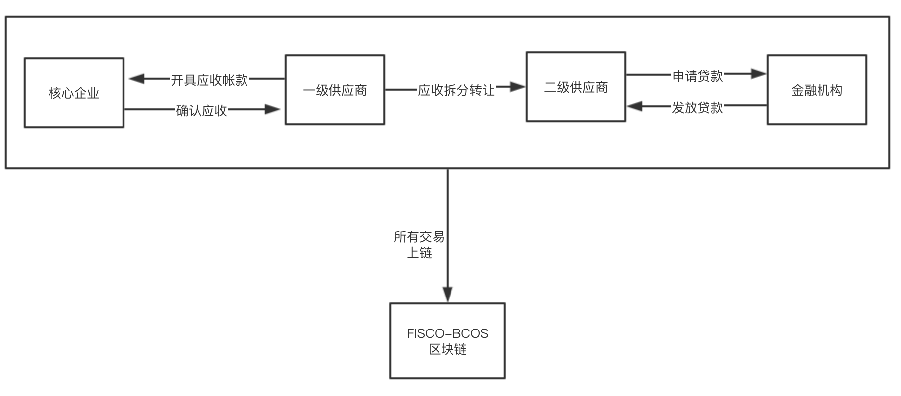

### 2. 存储设计
address类型为fisco-bcos的账户地址。

Company
- ad为主键
- 公司名称name
- 信用等级creditRating

<table>
<tr>
    <td>name:stirng</td>
    <td>ad:address</td>
    <td>creditRating:uint</td>
</tr>
</table>

Receipt
Receipt是应收单据结构，以id为主键
单据开票公司owner，
客户client，
应收款金额amount，
开票日期start
到期还款时间：ddl
是否被用作于向金融机构贷款的信用凭证：usedLoan，
其它备注、描述：description。
							

<table>
<tr>
    <td>id:uint</td>
    <td>owner:address</td>
    <td>client:address</td>
    <td>amount:uint</td>
    <td>start:uint</td>
    <td>ddl:uint</td>
    <td>usedLoan:bool</td>
    <td>description:string</td>
</tr>
</table>

### 3. 数据流图
 
### 4. 核心功能介绍

#### 发起和签署应收帐款

```go
//等待签署的应收款单据
mapping(uint => Receipt) public pending;
//公司到应收帐款的映射
mapping(address => Receipt[]) public receipts;
```
pending是单号到收据的映射，存放等待签署到应收款单据。
收款方发起一个应收款单据，合约会生成一个单号，并将应收款单据放入pending，付款方根据单号签署应收款单据，此时单据正式生效，然后放入receipts中。

receipts单据收款方地址到Receipt[]的映射。给出一个收款方企业地址，可以方便的找到该企业所有的应收帐款。
```go
//公司发起应收款单据
function IssueReceipt(address owner, address client, uint amount,uint ddl) public returns(uint id_){
    require(msg.sender==owner);
    pending[rid] = Receipt(rid,msg.sender,client,amount,0,now+ddl,false,"");
    id_ = rid;
    rid++;
    emit ReceiptIssued(owner,"receipt Issued");
}

//客户签署应收款单据
function SignReceipt(uint _id)public returns(bool){
    Receipt r = pending[_id];
    //签署人必须是该单据的client
    require(r.client == msg.sender,"your don't have permission to sign this receipt.");
    //单据未到期
    require(now < r.ddl);
    receipts[r.owner].push(Receipt(r.id, r.owner, r.client,r.amount,now,r.ddl,false,""));
    emit ReceiptIssued(msg.sender,"receipt signed");
    return true;
}
```

#### 应收帐款转移  
有应收帐款的企业可以向其他企业转移部分应收帐款。  
```go
function TransferTo(uint receiptid, address to, uint amount) public returns(uint id_){
        Receipt storage senderReceipt;
        for (uint i = 0; i < receipts[msg.sender].length;i++)
        {
            if (receipts[msg.sender][i].id==receiptid)
            {
                senderReceipt = receipts[msg.sender][i];
                break;
            }
            require(i != receipts[msg.sender].length - 1,"no such receipt id.");
        }

        require(senderReceipt.amount >= amount && amount > 0);
        //转移账款
        senderReceipt.amount -=amount;
        receipts[to].push(Receipt(rid,to, senderReceipt.client, amount, now,senderReceipt.ddl,false,""));
        id_ = rid;
        rid++;
        Transfered(msg.sender, to, amount,"transfer successfully");
    }
```

#### 利用应收帐款融资  
在企业向银行申请贷款后，银行可以调用该函数检查企业的应收帐款，如何符合要求则发放贷款。该函数交易上链后记录了企业（loanTo）利用应收帐款（receiptid）贷款这一事实。
```go
function MakeLoan(address loanTo, uint loanAmount, uint receiptid) public returns(bool){
        //放贷款必须是银行
        uint  cnt = 0;
        uint i;
        for ( i = 0; i < banks.length; i++)
        {
            if (banks[i].ad == msg.sender)
            {
                cnt++;
            }
        }
        require(cnt == 1);
        
        //找到应收款单据
        Receipt storage r;
        for (i = 0; i < receipts[loanTo].length;i++)
        {
            if (receipts[loanTo][i].id==receiptid)
            {
                r = receipts[loanTo][i];
                break;
            }
            require(i != receipts[msg.sender].length - 1,"no such receipt id.");
        }
        
        //false 说明该单据已经被用来贷款了
        require(r.usedLoan==false,"the receipt has been used for loan");
        require(r.amount >=loanAmount);
        r.usedLoan = true;
        Loaned(loanTo,loanAmount,"loaned successfully.");
        return true;
    }
```

#### 结算应收帐款 
上游企业根据单号，向下游企业支付amount的金额，如何完全结算，该应收款单据会从receipts中删除。  
由于该单据从创建、签署到结算到过程都记录在区块链上，所以从合约都状态变量receitps中删除单据并不影响这一记录。

```go
function PayForReceipt(address owner, uint amount,uint receiptid) public returns(bool){
    Receipt storage r;
    uint i;
    for (i = 0; i < receipts[owner].length;i++)
    {
        if (receipts[owner][i].id==receiptid)
        {
            r = receipts[owner][i];
            break;
        }
        require(i != receipts[msg.sender].length - 1,"no such receipt id.");
    }
    
    require(r.client == msg.sender,"sender doesn't match receipt's client");
    require(r.amount >= amount,"payment exceeds receipt'amount");
    r.amount -= amount;
    if(r.amount > 0)
        return true;
    for(;i<receipts[owner].length - 1;i++)
    {
        receipts[owner][i] = receipts[owner][i+1];
    }
    delete receipts[owner][i];
    receipts[owner].length--;
    pay(msg.sender, owner, amount,"pay for receipt successfully.");
    return true;
}
```

### 5. 客户端与区块链通信
利用webase-front提供的接口   
- 网络传输协议：使用HTTP协议
- 请求地址：/contract/transaction
- 请求方式：POST
- 请求头：Content-type: application/json
- 返回格式：JSON

发送交易  
通过合约信息进行调用，前置根据调用的合约方法是否是“constant”方法区分返回信息，“constant”方法为查询，返回要查询的信息。非“constant”方法为发送数据上链，返回块hash、块高、交易hash等信息。  

|序号	|中文	 |参数名|	 类型|  	必填|	
|:--:| :--:| :--:| :--:| :--:| :--:| :--:| 
|1|	用户编号|	user	|String      |		是|	
|2|	合约名称	|contractName|	String		|是	|
|3|	合约地址	|contractAddress	|String	|	是	|
|4|	方法名|	funcName|	String	    |	是	|
|5|	方法参数	|funcParam|	List	 |   	|
|6	|群组ID	|groupId	|int			
|7|	是否是加密私钥|	useAes|	boolean	 |	否 	|

下面是部分交易的API示例
#### 1)查询receipts
funcParam
- owner
- index

```
curl -l -H "Content-type: application/json" -X POST 
-d '{"contractName":"D", 
"funcName": "receipts", 
"funcParam": ["0x7d6773df655b3c03916c2a518a55230087680700","0"], 
"user": "", 
"useAes": false, "contractAddress":"0x81d548767282713612b95606f79789f382f998fc",
"groupId": 1}'
http://localhost:5002/WeBASE-Front/trans/handle
```


#### 2)IssueReceipt
funcParam
- owner
- to
- amount
- ddl
  
```
curl -l -H "Content-type: application/json" -X POST 
-d '{"contractName":"D", 
"funcName": "IssueReceipt", 
"funcParam": ["0x7d6773df655b3c03916c2a518a55230087680700","0xd2a1ad13167709f2437ca7dbf6a0994cbe757f81","523190095","10000000000"], 
"user": "0x7d6773df655b3c03916c2a518a55230087680700", 
"useAes": false, 
"contractAddress":"0x81d548767282713612b95606f79789f382f998fc",
"groupId": 1}' 
http://localhost:5002/WeBASE-Front/trans/handle
```

## 三、	功能测试

### 添加bank，用于贷款
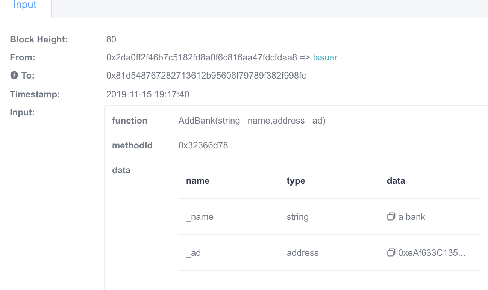


### 轮胎公司发布车企的应收款单据，65536元，其客户为宝马车企：
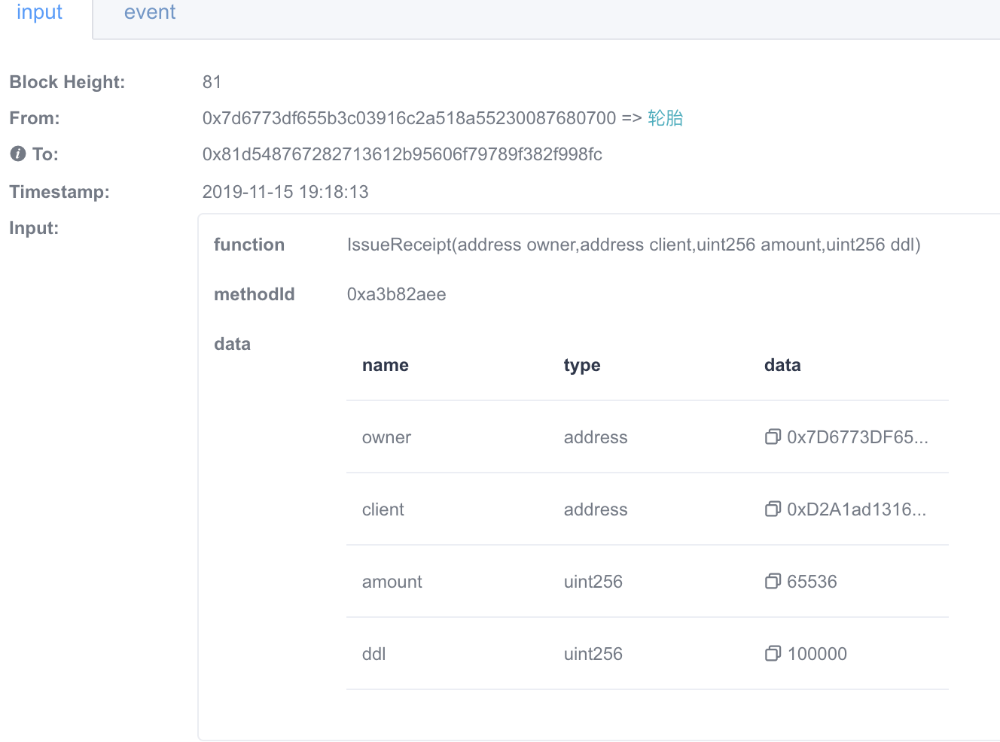
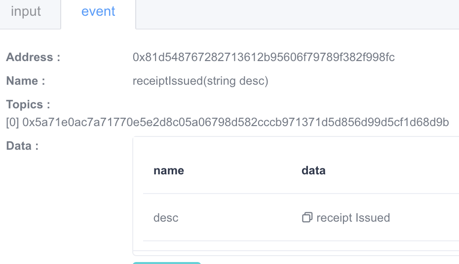
## 其他人比如Alice，不能签署轮胎公司发布的单据
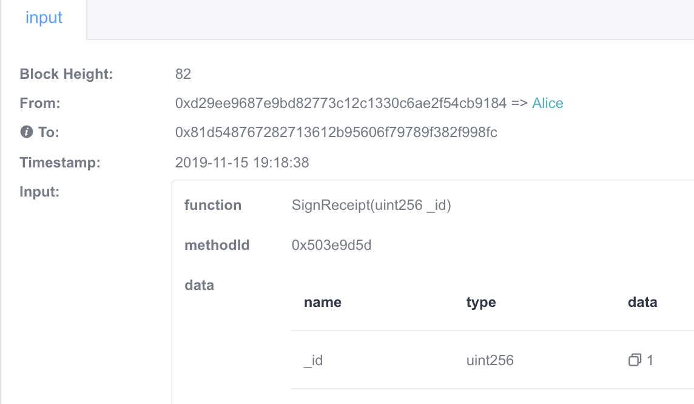

## 只有车企可以签署:
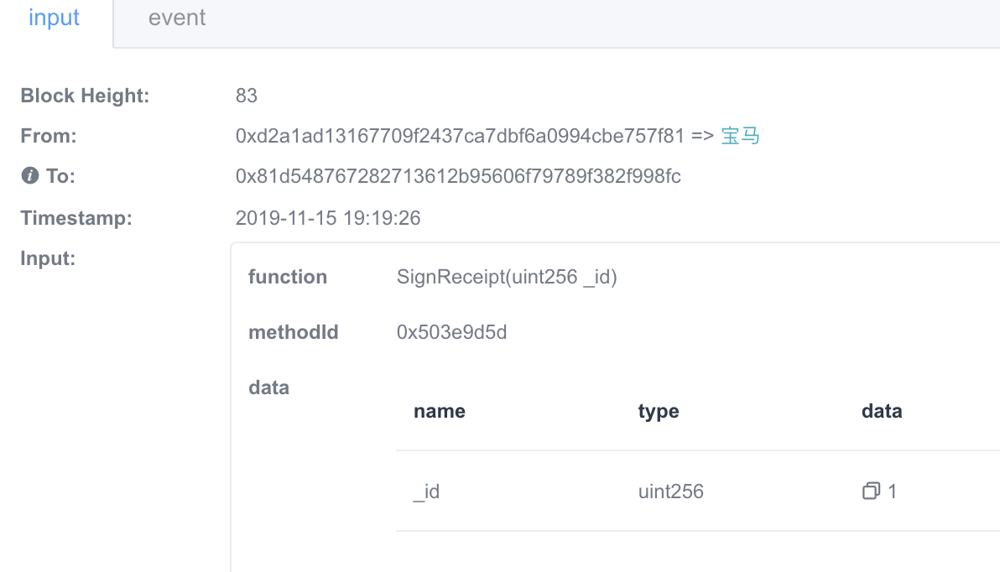  
成功签署event：
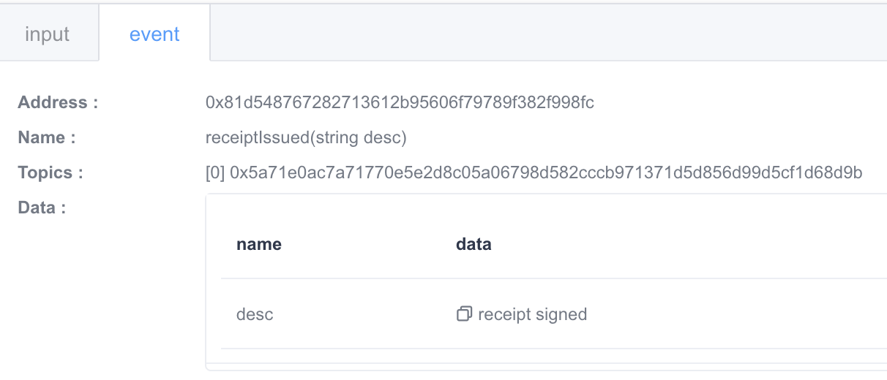


### 轮胎公司将应收账款2048元转让给轮毂公司
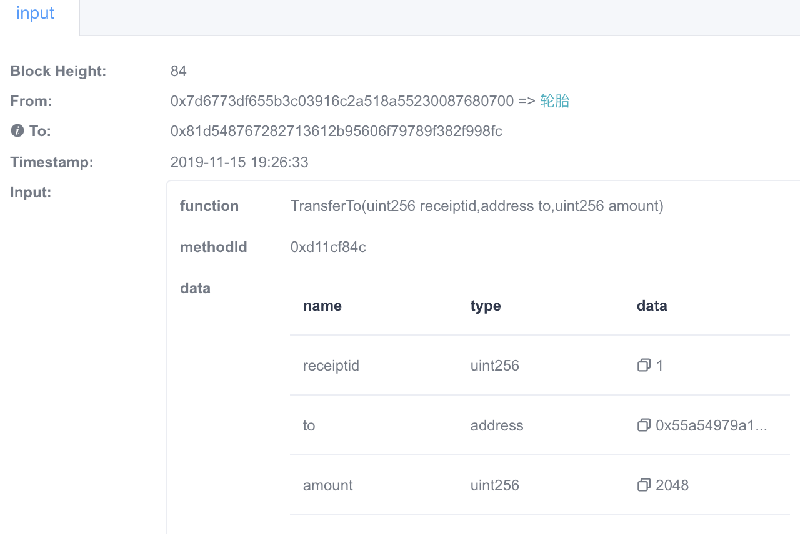

此时轮毂公司的应收帐款：
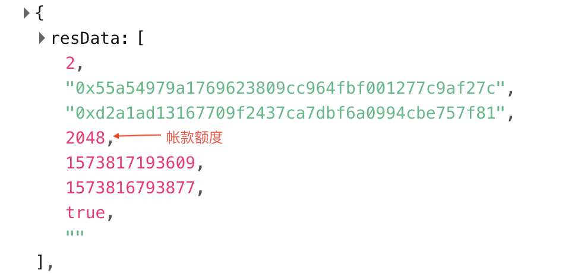     

轮胎公司的应收帐款额减少2048元，变为63488元：
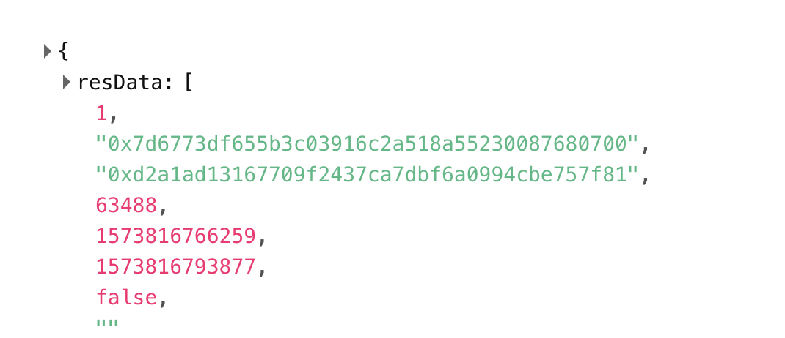


### 轮毂公司凭借该应收账款向银行贷款1024元，银行放贷给轮毂公司 
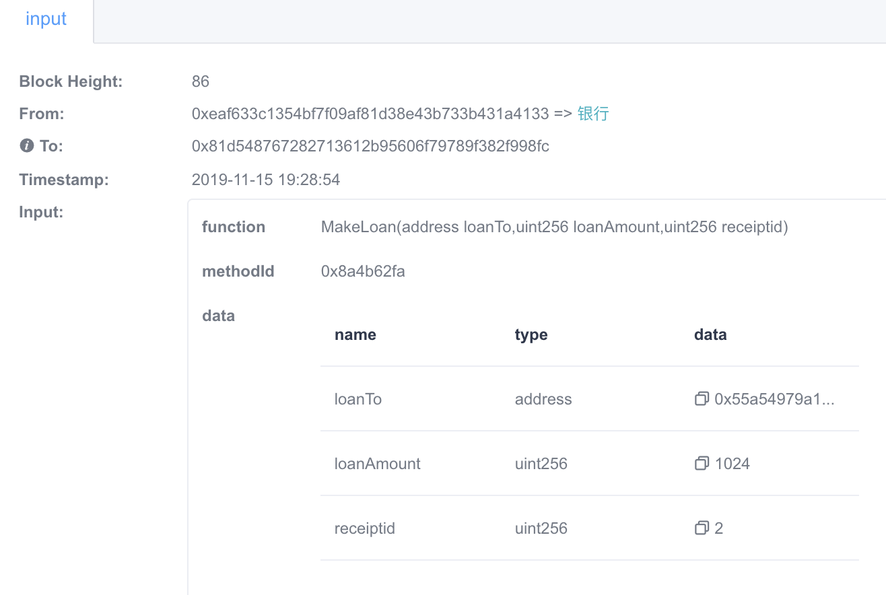


### 车企向轮毂公司还款
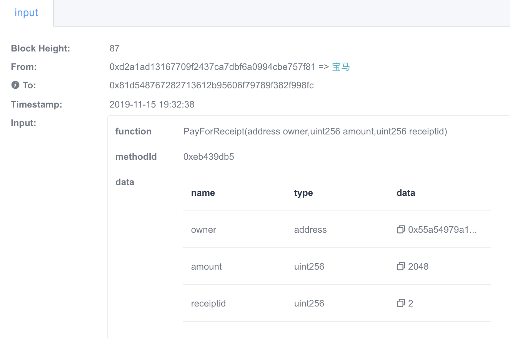  

### 车企向轮胎公司换还一部分款 
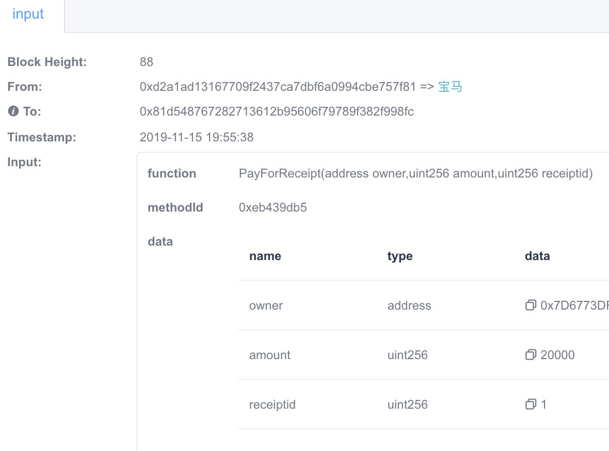

## 四、	界面展示
正在完成......
## 五、	心得体会
区块链原理与技术大作业一共经历了三个阶段，第一，熟悉fisco-bcos底层区块链平台；第二，编写相关智能合约；第三，完成整个区块链供应链平台。  
每个阶段都有很大的收获。从使用fisco-bcos平台的过程中理解联盟链与以太坊共有链之间的区别。联盟链是指由多个机构共同参与管理的区块链，每个组织或机构管理一个或多个节点，其数据只允许系统内不同的机构进行读写和发送。盟链上的读写权限和记账权限都由联盟规则限定，联盟链的共识过程由预先选好的节点控制。一般来说适合于机构间的交易、结算或清算等B2B场景。
编写智能合约可以说是积累实战经验的开始，由自己部署合约，发送交易，查询区块信息等，对区块链由了更直观的认识。

